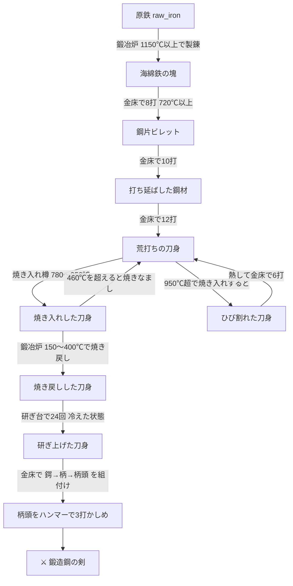

# Real Swordsmithing | 本格剣鍛冶MOD

**現実の刀剣製作の工程を忠実に再現した Minecraft MOD です。剣はクラフトテーブルでは作れません。**
鉱石の製錬から、鍛造・焼き入れ・焼き戻し・研ぎ・柄付けまで、実際の鍛冶仕事をあなたの手で行います。

- 対応: **Minecraft 1.21.1 / Fabric Loader 0.16+ / Fabric API / Java 21**
- ID: `swordsmith`

---

## 特徴

- **温度シミュレーション** — 金属はニュートンの冷却法則に従って実時間で冷めます。温度は摂氏で管理され、色名(暗赤熱・赤熱・橙熱・黄熱・白熱)と加熱ゲージで確認できます。
- **クラフト不要の剣** — 「鍛造鋼の剣」はクラフトレシピを持ちません。入手手段は鍛冶仕事だけです。
- **火傷システム** — 150℃を超えた金属を素手で持つと燃えるようなダメージを受けます。**鍛冶やっとこ**を手に持てば安全(代わりにやっとこが消耗)。
- **失敗もリアル** — 焼き入れが熱すぎれば刀身は割れ、焼き戻しで加熱しすぎれば硬さが失われます。割れた刀身は熱して打ち直せば復活できます。
- **見える鍛冶** — 炉や金床に置いた加工品は実際に3D描画されます。火の入った炉では加工品が明るく輝きます。
- **鍛冶炉GUI** — 素手で右クリックするとバニラ様式の画面が開き、**適温帯を色分けした温度計**(ホバーで温度早見ツールチップ)・燃料スロット+炎ゲージ・送風ゲージ・製錬/焼き戻しの進行矢印が確認できます。ハンマーとふいごは今まで通り「実際に叩く・吹く」操作です。
- **温度HUD** — 加熱された加工品を手に持つと、ホットバー右上にリアルタイムの温度ゲージ(鍛造720℃/焼き入れ780〜950℃の目盛り付き)が表示されます。
- **進捗ツリー** — 工程に沿った進捗9種(隠し進捗あり)が道しるべになります。

## 工程の全体像



## 遊び方ガイド

### 0. 道具と設備を整える(ここだけは普通のクラフト)

| 作る物 | 材料 |
|---|---|
| 鍛冶炉 | 石レンガ×8(中央空き) |
| 鍛冶の金床 | 鉄インゴット×7 |
| 焼き入れ樽 | 板材×7(コの字) |
| 研ぎ台 | なめらかな石×2+板材×2 |
| 鍛冶ハンマー | 鉄×3+棒×2 |
| 鍛冶やっとこ | 鉄×3+棒×2 |
| 手ふいご | 板材×6+革×3 |
| 鍔/柄/柄頭 | 鉄・革・棒 少々 |

### 1. 火を起こす

1. 鍛冶炉に**木炭または石炭**を右クリックでくべる(燃料スロットにストックされ、1個=60秒ずつ火にくべられる)
2. **火打石と打ち金**で点火。送風なしの熾火(おきび)は**約300℃**で安定します
3. **手ふいご**で右クリックして送風。吹くほど炎が強まり**最大約1280℃**(送風は時間とともに弱まるので、高温を保つには吹き続ける)
4. **素手で右クリックするとGUIが開き**、温度計・燃料・送風・進行状況を確認しながら材料を出し入れできます(熱い材料を素手で取り出すと火傷するのは変わりません。やっとこを持って右クリックすれば直接取り出せます)

### 2. 製錬(せいれん)

**原鉄(raw iron)** を持って炉を右クリックして投入。**1150℃以上を30秒**保つと「海綿鉄の塊」に。ふいごを数秒おきに吹き続けて火力を維持すること(まさに、たたら吹き)。

### 3. 鍛造(たんぞう)

1. 熱した加工品を炉から取り出し(**やっとこを手に!**)、金床に置く
2. **鍛冶ハンマー**で右クリックして打つ。**720℃以上**でしか金属は動きません
3. 冷えたら炉で熱し直す(打つたびに約12℃、置いておくだけでも冷めます)
4. 海綿鉄→鋼片→鋼材→**荒打ちの刀身**と打ち進める

### 4. 焼き入れ(やきいれ)

刀身を **780〜950℃(赤熱)** にして、水を張った焼き入れ樽に右クリックで浸けます。

- 950℃超 → **割れる**(打ち直しで復活可)
- 780℃未満 → 焼きが入らない
- 適温 → **焼き入れした刀身**(硬いが脆い)

### 5. 焼き戻し(やきもどし)

焼き入れした刀身を、**送風していない熾火の炉(約300℃)** に入れて20秒待つと「焼き戻しした刀身」に。
**460℃を超えると硬さが失われて荒打ちに逆戻り**するので、焼き戻し中は絶対にふいごを吹かないこと。焼き入れ・焼き戻し後の刀身を再び強火にかけた場合も同様になまります。

### 6. 研ぎ

冷えた刀身を持って研ぎ台を右クリック×24回。熱いまま研ぐと焼きが戻るため研げません。

### 7. 柄付け(つかつけ)

研ぎ上げた刀身を金床に置き、**鍔 → 柄 → 柄頭**の順に右クリックで組み付け、最後にハンマーで**3回かしめて**完成。素手で右クリックして手に取りましょう。

> **鍛造鋼の剣**: 攻撃力7・攻撃速度1.8・耐久780・エンチャント性14。刀身1本を消費して金床修理も可能。

## 温度早見表

| 温度 | 表示 | できること |
|---|---|---|
| 〜60℃ | 常温 | 研ぎ・柄付け |
| 150℃〜 | 黒熱 | ⚠ 素手で持つと火傷 |
| 150〜400℃ | 黒熱 | 焼き戻し(熾火≒300℃が最適) |
| 460℃〜 | 黒熱〜 | ⚠ 焼き入れ済みの刀身がなまる |
| 720℃〜 | 暗赤熱〜 | 鍛造(ハンマー) |
| 780〜950℃ | 赤熱 | 焼き入れ |
| 1150℃〜 | 黄熱〜 | 製錬(原鉄→海綿鉄) |
| 〜1280℃ | 白熱 | 炉の最高温度(送風時) |

## ビルド方法

Minecraft本体・Fabricのダウンロードのため、`piston-meta.mojang.com` / `libraries.minecraft.net` / `maven.fabricmc.net` へのネットワークアクセスが必要です。

```bash
./gradlew build          # → build/libs/swordsmith-1.0.0.jar
./gradlew runClient      # 開発用クライアント起動
```

生成された `swordsmith-1.0.0.jar` を、Fabric Loader + Fabric API を導入した `mods` フォルダへ入れてください。

## リポジトリ構成

- `src/main/java/dev/shinorange/swordsmith/` — 本体(温度系 `core/`、ブロック `block/`、アイテム `item/`、描画 `client/`)
- `src/main/resources/assets|data/` — モデル・テクスチャ・言語(日/英)・レシピ・ルートテーブル
- `tools/gen_assets.py` — 全JSONアセットと16×16テクスチャの生成スクリプト(再実行可)

## License

MIT
